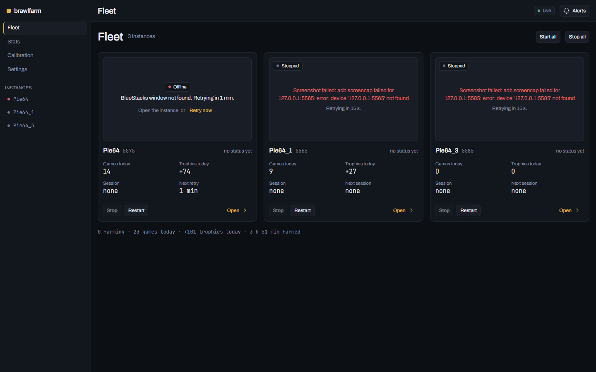
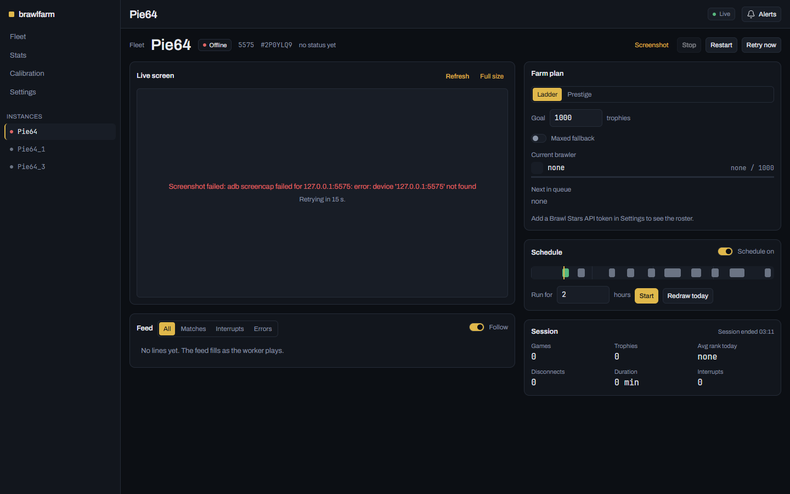
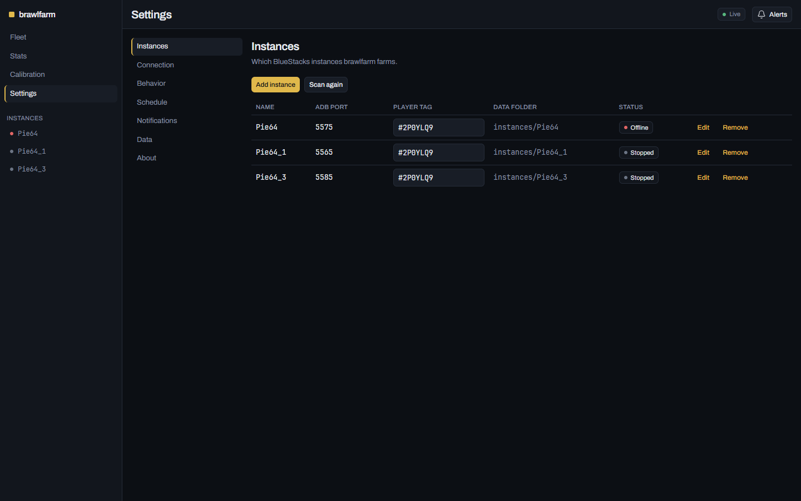
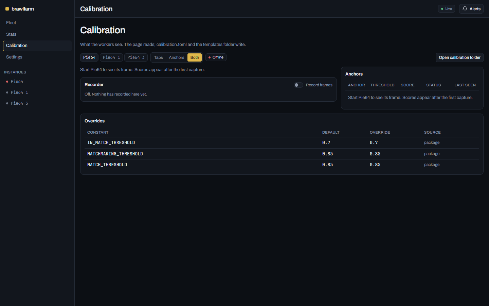

# brawlfarm

An open-source Brawl Stars trophy farmer for BlueStacks on Windows, with a local control panel in your browser.

Status: v1.0.0. Phases 1 to 7 of the plan are done; phase 8 (a calibration page, recalibration for the current game version, a desktop window and tray icon, a labeled frame recorder) follows. See `docs/PLAN.md`.

## Screenshots

The panel, running against a scratch data directory with three example instances: one offline, two stopped.


Fleet: every instance at a glance, with start, stop and restart controls.


Instance: the live screen, the farm plan, the day's schedule and the session so far.


Settings: instances, adb connection, behavior switches, schedule and notifications.


Calibration: what the workers see, the anchor scores and the threshold overrides in force.

## What it does

- Farms Trio Showdown on its own: queue, play, results, back to the menu, repeat.
- Survives interruptions: rewards, popups, rank-ups, disconnects, crashes, freezes, team invites.
- Two farm modes: ladder (raise the whole roster in 100-trophy tiers) and prestige (finish one brawler to 1000 at a time), plus an optional maxed fallback.
- An anti-ban scheduler that plays human-shaped sessions with breaks, on by default.
- Runs several BlueStacks instances at once, one worker per instance.

## Safety rails

These are absolute and are enforced in code and in review:

- Never taps ACCEPT on a team invite, GET or Upgrade, EQUIP NOW, any shop buy button, the pass VAULT, or anything priced in gems. Never blind-taps in the shop.
- Every navigation verifies the screen before acting and bails to the menu on a failed check, so stale coordinates degrade to logged no-ops.
- One worker per instance. Processes are stopped by the PID recorded in that instance's status file, never by name.
- No AI in the runtime loop: deterministic OpenCV template matching and OCR.

## Requirements

Windows 11, BlueStacks 5 with Android Debug Bridge enabled, an instance display of 1600 x 900 at pixel density 240, Python 3.13 and [uv](https://docs.astral.sh/uv/).

## Install

Clone the repository and `uv sync`, or, once the first release is on PyPI, install it as a tool:

```
uv tool install brawlfarm            # a brawlfarm command on your PATH
uv tool install "brawlfarm[desktop]" # the same, plus --window and the tray icon
uvx brawlfarm                        # run it once without installing it
```

The commands below assume the checkout and say `uv run brawlfarm`; with a tool install the command is just `brawlfarm`. `docs/setup.md` is the step by step walkthrough and `docs/release.md` is how a release ships.

## Setup

Start brawlfarm and open `http://127.0.0.1:8765/setup`. The wizard finds adb, lists your BlueStacks instances and their ports, checks each one is 1600 x 900 at pixel density 240, and optionally takes a Brawl Stars API token and your player tags. Every step writes straight to `config.toml`, so you can close it and come back. With nothing configured yet, the Fleet page offers the same wizard behind an Open setup button, and Settings, Connection has a Run setup again link once you are past it.

To change the display: BlueStacks, Settings, Display, set 1600 x 900 and pixel density 240, then restart the instance. The step by step walkthrough is `docs/setup.md`.

## Development

```
uv sync --group dev
corepack enable
pnpm --dir brawlfarm/web install
pnpm --dir brawlfarm/web build     # the panel is served from brawlfarm/web/dist
uv run pytest
pnpm --dir brawlfarm/web test && pnpm --dir brawlfarm/web typecheck
uv run ruff check . && uv run ruff format --check .
uv run python tools/scrub_check.py
```

If `corepack enable` fails with EPERM, which is what a Windows shell without elevation gives you, `npm install -g pnpm@10.17.1` installs the same pnpm.

`pnpm --dir brawlfarm/web dev` serves the panel on Vite's port with hot reload and proxies `/api` to a `uv run brawlfarm` on 8765, so the two run side by side while you work on the UI.

## Running

```
uv run brawlfarm                 # supervise every instance and open the panel
uv run brawlfarm --no-browser    # same, without opening a browser
uv run brawlfarm --port 9000     # serve the panel somewhere else
uv run brawlfarm --once          # one supervisor tick, print the instances, exit
uv run brawlfarm --window        # a desktop window and a tray icon instead of the browser
```

`--window` needs the optional desktop extras, which `uv sync --group desktop` installs in a checkout and `uv tool install "brawlfarm[desktop]"` installs from PyPI; without them brawlfarm says so and opens the browser as usual. Closing the window only hides it to the tray icon, whose menu has Open panel and Quit.

Settings live in `%LOCALAPPDATA%\brawlfarm\config.toml` (override the folder with `BRAWLFARM_HOME`). Add one `[[instances]]` table per BlueStacks instance with its `name` and `adb_port`; each instance's files live under `instances/<name>/`. Stopping the process leaves workers running; the next start reattaches to them through their status files.

## The panel and its API

The panel lives at `http://127.0.0.1:8765/`: a Fleet page with one card per instance led by its live screen, and an Instance page with the screen, the activity feed in plain sentences, the farm plan, today's schedule and the session's figures. Change the port in Settings (it takes effect on the next start) or for one run with `--port`. The API behind it is browsable at `http://127.0.0.1:8765/docs`.

The API binds 127.0.0.1 only and has no authentication: anything that can reach it can drive your instances, so do not port-forward it or put it behind a reverse proxy.

| Method | Path | What it does |
| --- | --- | --- |
| GET | `/api/health` | version, data directory, instance count, uptime |
| GET | `/api/instances` | one payload per instance: state, phase, session, today's games and trophies, and the last finished session |
| POST | `/api/instances/{name}/start` | start, or run for `{"hours": N}` |
| POST | `/api/instances/{name}/stop` | stop after the current match |
| POST | `/api/instances/{name}/stop-now` | kill the worker by its PID, only while a stop is pending |
| POST | `/api/instances/{name}/restart` | stop now, relaunch on the next tick |
| POST | `/api/instances/{name}/retry` | clear the offline backoff and probe again |
| DELETE | `/api/instances/{name}/data` | delete that instance's folder; the instance stays in `config.toml` |
| GET | `/api/instances/{name}/screenshot.png` | a live adb screencap |
| GET | `/api/instances/{name}/preview.jpg` | the small frame the worker writes every second, or one throttled live capture when it is stopped |
| GET, PUT | `/api/instances/{name}/plan` | the farm plan, plus the owned roster, the queue and the current brawler |
| GET, PUT | `/api/instances/{name}/schedule` | today's sessions, the override, on/off, redraw |
| GET | `/api/instances/{name}/feed` | session narration with a `seq` on every record, `kind=all\|matches\|interrupts\|errors` |
| GET | `/api/stats` | `range=today\|7d\|30d\|all`, `instances=a,b` |
| GET | `/api/stats/export.csv` | the same selection as a CSV download |
| GET | `/api/brawlers/{name}/icon.png` | the brawler's portrait from a local cache, fetched once from the Brawlify CDN |
| GET | `/api/connection/check` | whether the Brawl Stars token works: `ok`, `no_token`, `no_tag`, `rejected` or `unreachable` |
| GET, PUT | `/api/settings` | the whole `config.toml` document |
| POST | `/api/settings/reset` | every section back to its default; instances and their folders are kept |
| POST | `/api/settings/open-data-folder` | open the data folder in Explorer; 501 anywhere but Windows |
| POST | `/api/notifications/test` | send one test alert to every configured channel |
| POST | `/api/setup/scan` | find adb and the BlueStacks instances |
| POST | `/api/setup/test` | can adb reach this port |
| POST | `/api/setup/display-check` | is this instance 1600 x 900 at DPI 240 |
| GET | `/api/alerts` | the alert list and its unread count |
| POST | `/api/alerts/{id}/dismiss` | mark one alert read |
| POST | `/api/alerts/dismiss-all` | mark every alert read |
| GET | `/api/events` | server-sent events |

### Live events

`GET /api/events` is a server-sent event stream with four kinds: `instance` (a state change), `feed` (a new session narration line), `alert`, and `log` (the supervisor's own log lines). It replays from `Last-Event-ID` on a reconnect and sends a keepalive comment every 15 seconds. Alerts are kept in memory only, so a restart clears them; the session files under `instances/<name>/` keep the history.

### Notifications and health monitoring

`[notifications]` in `config.toml` takes a webhook URL, an ntfy topic and server, the list of event kinds worth sending, and `healthchecks_url`. Every completed supervisor tick GETs that URL, so a supervisor that stops ticking raises an alarm on healthchecks.io, or anything else that speaks the same one-URL protocol, without you watching the window.

## Calibration

Calibration in the left rail shows what the workers see: the chosen instance's live frame with the tap points and the anchor boxes drawn on it, and a table of every template with its threshold, its score on that frame and whether its status is Found, Drift or Absent.

The values behind it are overridable from the calibration folder, which is `%LOCALAPPDATA%\brawlfarm\calibration\` by default and `<home>/calibration` under `--home`.

`calibration.toml` is flat TOML, one constant per line, taking tap coordinates as two integers and thresholds and timings as numbers; it is read once at startup, so a change needs a restart, and the page reports both the bad lines and the fact that the file has moved on.

A PNG at `templates/<name>.png`, under one of the thirteen packaged template names, replaces that template on the next capture without a restart.

The Record frames switch writes labeled JPEG frames and a `labels.jsonl` into `recordings/<instance>/<yyyymmdd-hhmmss>/` for recalibration work, one frame per second or on any state change, capped at 2000 frames a session and 512 MiB an instance, and it never deletes anything.

`docs/calibration.md` has the whole of it, including what the page will not do: it reads, and the files write.

## Contributing

Bug reports and pull requests are welcome, and `CONTRIBUTING.md` has the conventions and the checks to run before you open one. One rule outranks every other: a change to the never-tap logic or the safety rails is not merged on any other merit, however good the rest of the change is.

## Legal

brawlfarm is not affiliated with or endorsed by Supercell. Brawler art is served from the Brawlify CDN and belongs to Supercell under its fan content policy. Automating the game may violate its terms of service; use at your own risk. MIT licensed.
